  

<picture>
  <source media="(prefers-color-scheme: dark)" srcset="https://githubusercontent.com">
  <source media="(prefers-color-scheme: light)" srcset="https://githubusercontent.com">
  
</picture>

