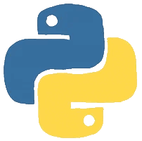

  

## About Me

I'm Richard — a developer in the middle of a full‑stack transformation. After years leading global teams in recruitment and operations, I shifted into software engineering to build things with clarity, structure, and purpose.

I learn best by breaking problems into small, testable steps and building iteratively. My GitHub is a reflection of that: practical projects, real debugging, and honest progress. I'm focused on understanding how full‑stack systems fit together — from data flow, to API design, to UI behaviour — and turning that understanding into reliable, maintainable code.

My goal is simple: become a confident full‑stack engineer who can ship features, solve problems, and collaborate effectively.

## 🛠️ Tech Stack

  
  
  
  
  
  
  
  

<picture>
  <source media="(prefers-color-scheme: dark)" srcset="https://raw.githubusercontent.com/MoustacheCode/MoustacheCode/output/github-contribution-grid-snake-dark.svg">
  <source media="(prefers-color-scheme: light)" srcset="https://raw.githubusercontent.com/MoustacheCode/MoustacheCode/output/github-contribution-grid-snake.svg">
  
</picture>

